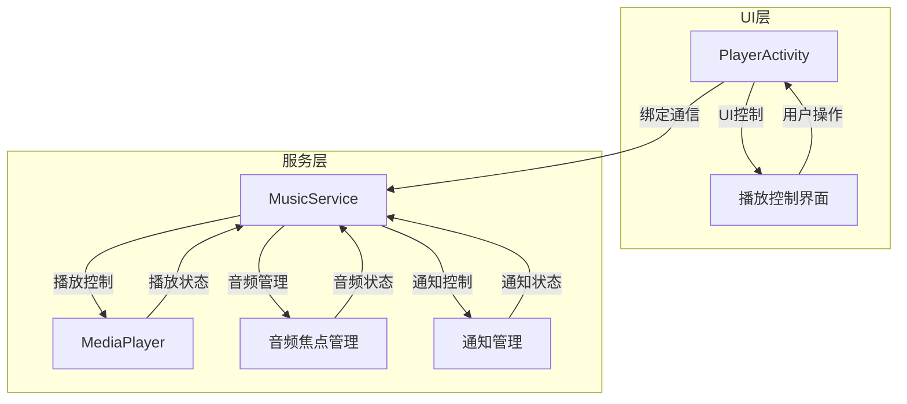
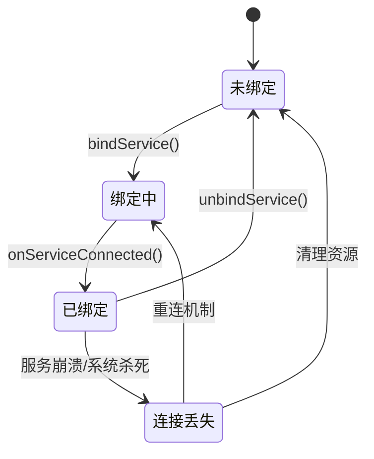
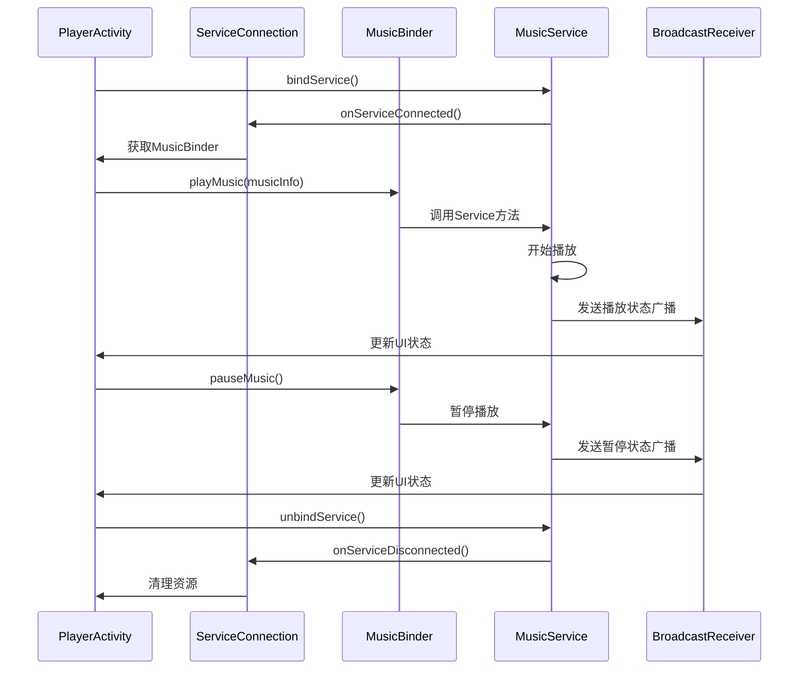
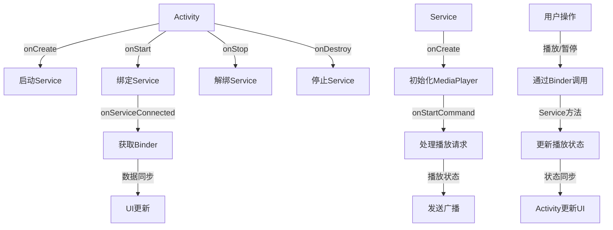

# PlayerActivity与MusicService交互架构分析

## 📋 文档概述

本文档深入分析Android音乐播放器应用中PlayerActivity与MusicService之间的绑定、通信和交互机制，基于实际代码实现进行详细讲解。

### 📚 文档结构

| 章节 | 内容描述 | 重点内容 |
|------|----------|----------|
| 1. 核心架构概述 | 整体设计思路和架构图 | 设计理念、架构图、架构优势 |
| 2. 服务启动与绑定 | Service启动和绑定流程 | 启动绑定流程、代码实现、关键点解析 |
| 3. ServiceConnection机制 | 连接桥梁和回调机制 | 连接桥梁、代码实现、核心回调方法 |
| 4. MusicBinder设计 | 代理模式和通信功能 | 代理模式设计、代码实现、设计模式分析 |
| 5. 数据交互流程 | 双向数据传递和状态同步 | 数据流向分析、具体实现、交互时序图 |
| 6. 生命周期管理 | 服务生命周期管理 | 绑定解绑时机、生命周期流程图、最佳实践 |
| 7. 代码优化建议 | 代码改进和最佳实践 | 服务重连机制、状态同步优化、错误处理增强 |
| 8. 总结与展望 | 架构评估和未来展望 | 架构优势总结、核心设计原则、适用场景 |

### 👥 适用对象

- **Android开发者**：深入了解Activity与Service的通信机制
- **音乐播放器应用开发者**：学习后台播放服务的实现方案
- **学习Android组件通信的学生**：掌握Android组件间通信的最佳实践

### 🎯 学习目标

通过阅读本文档，您将能够：
- 理解PlayerActivity与MusicService的绑定机制
- 掌握ServiceConnection和MusicBinder的工作原理
- 实现高效的数据交互和状态同步
- 应用最佳实践优化代码质量

# 1. 🏗️ 核心架构概述

## 1.1 🎯 设计理念

PlayerActivity和MusicService采用了Android标准的**绑定服务（Bound Service）**模式进行通信，同时结合**启动服务（Started Service）**确保音乐播放的持久性。这种设计既保证了Activity与Service之间的高效通信，又确保了音乐在后台稳定运行。

### 设计原则
- **职责分离**：UI交互与播放逻辑分离
- **生命周期独立**：服务独立于Activity生命周期
- **高效通信**：使用Binder机制实现进程内通信
- **用户体验**：后台播放和前台控制的无缝切换

## 1.2 📊 架构图



## 1.3 ⭐ 架构优势

| 优势 | 描述 | 实现方式 |
|------|------|----------|
| **解耦设计** | UI层与播放逻辑分离 | Activity负责UI，Service负责播放 |
| **生命周期管理** | 服务独立于Activity生命周期 | 绑定+启动双重模式 |
| **高效通信** | 进程内低延迟通信 | Binder机制 |
| **用户体验** | 后台播放无缝切换 | 服务持久化运行 |
| **可扩展性** | 易于添加新功能 | 清晰的接口设计 |

# 2. 🚀 Activity与Service交互关系详解

## 2.1 📋 交互关系总览

Activity与Service通过**绑定机制**建立通信桥梁，实现前后台分离的播放架构。

### 核心交互关系
- **启动关系**：Activity启动Service
- **绑定关系**：Activity绑定Service获取Binder
- **通信关系**：通过Binder进行方法调用
- **数据流关系**：状态和数据的双向传递

## 2.2 🔄 交互步骤详解

### 第一步：Activity启动Service
**目的**：创建后台播放服务

```java
/**
 * 第一步：启动MusicService
 * 设计意图：创建独立的播放进程，实现后台播放能力
 * 
 * 方法分析：
 * 1. Intent创建：明确指定目标服务类，建立通信意图
 * 2. startService()：启动服务生命周期，确保后台运行
 * 3. 日志记录：便于调试和状态追踪
 * 
 * 技术要点：
 * - Intent是Android组件通信的核心机制
 * - startService()会触发Service的onCreate()和onStartCommand()
 * - 服务启动后独立于Activity生命周期运行
 */
private void startMusicService() {
    // 创建Intent指向MusicService
    Intent intent = new Intent(this, MusicService.class);
    
    // 启动服务（创建服务实例）
    startService(intent);
    Log.i("PlayerActivity", "第一步：MusicService启动完成");
}
```

**关系说明**：
- Activity作为**启动者**，Service作为**被启动者**
- 建立**进程间**的启动关系
- Service进入后台运行状态

**方法深度解析**：
- **Intent机制**：Intent是Android组件间通信的桥梁，通过指定目标组件类名建立连接
- **服务生命周期**：startService()会依次调用Service的onCreate()和onStartCommand()方法
- **后台运行**：启动的服务独立于Activity，即使Activity销毁也能继续运行
- **资源管理**：服务启动后占用系统资源，需要在适当时机停止服务

### 第二步：Activity绑定Service
**目的**：建立双向通信通道

```java
/**
 * 第二步：绑定MusicService
 * 设计意图：获取Service的Binder，建立通信桥梁
 * 
 * 方法分析：
 * 1. Intent复用：使用相同的Intent对象，避免重复创建
 * 2. bindService()：建立绑定关系，获取Binder通信接口
 * 3. BIND_AUTO_CREATE：自动创建服务标志，确保服务存在
 * 4. 返回值处理：检查绑定结果，处理异常情况
 * 
 * 技术要点：
 * - bindService()是异步操作，结果通过ServiceConnection回调
 * - BIND_AUTO_CREATE确保服务在绑定前已启动
 * - 绑定关系建立后，Activity可以调用Service方法
 */
private void bindMusicService() {
    Intent intent = new Intent(this, MusicService.class);
    
    // 绑定服务，建立双向通信
    boolean bindResult = bindService(intent, conn, BIND_AUTO_CREATE);
    
    if (bindResult) {
        Log.i("PlayerActivity", "第二步：MusicService绑定成功，通信通道建立");
    } else {
        Log.e("PlayerActivity", "第二步：MusicService绑定失败");
    }
}
```

**关系说明**：
- Activity作为**绑定者**，Service作为**被绑定者**
- 建立**双向通信**的绑定关系
- ServiceConnection作为**连接监听器**

**方法深度解析**：
- **异步绑定机制**：bindService()立即返回，实际绑定过程在后台执行
- **Binder通信**：绑定成功后，通过IBinder接口实现进程间通信
- **生命周期关联**：绑定关系会影响Service的生命周期管理
- **错误处理**：绑定失败可能由于权限不足或服务未注册等原因

### 第三步：获取Binder建立通信
**目的**：通过Binder进行方法调用

```java
/**
 * ServiceConnection实现 - 处理绑定状态变化
 * 
 * 类分析：
 * ServiceConnection是Android系统提供的接口，用于监听服务绑定状态
 * 包含两个核心回调方法：onServiceConnected和onServiceDisconnected
 */
private final ServiceConnection conn = new ServiceConnection() {
    
    /**
     * 第三步：服务连接成功回调
     * 关系：Activity ← Binder → Service
     * 
     * 方法分析：
     * 触发时机：服务绑定成功时系统自动调用
     * 参数说明：
     * - ComponentName componentName：连接的组件信息
     * - IBinder binder：服务返回的Binder对象
     * 
     * 技术要点：
     * - 类型转换：将IBinder转换为具体的MusicBinder类型
     * - 数据同步：连接成功后立即同步歌曲列表
     * - 状态验证：检查Binder对象有效性
     * 
     * 执行流程：
     * 1. 获取Binder实例 → 2. 类型转换 → 3. 数据同步 → 4. 状态更新
     */
    @Override
    public void onServiceConnected(ComponentName componentName, IBinder binder) {
        // 获取MusicBinder实例
        musicBinder = (MusicService.MusicBinder) binder;
        Log.i("PlayerActivity", "第三步：Binder获取成功，通信桥梁建立");
        
        // 此时Activity可以通过Binder调用Service方法
        if (musicBinder != null) {
            // 示例：同步歌曲列表到Service
            if (musics != null) {
                musicBinder.updateMusicList(musics);
            }
        }
    }
    
    /**
     * onServiceDisconnected方法分析：
     * 触发时机：服务异常断开时系统自动调用
     * 参数说明：
     * - ComponentName componentName：断开的组件信息
     * 
     * 技术要点：
     * - 资源清理：及时释放Binder引用，避免内存泄漏
     * - 状态重置：重置连接状态，准备重新连接
     * - 异常处理：记录断开日志，便于问题排查
     * 
     * 注意：正常解绑不会触发此回调，仅在服务崩溃时调用
     */
    @Override
    public void onServiceDisconnected(ComponentName componentName) {
        Log.w("PlayerActivity", "服务连接断开");
        musicBinder = null;
    }
};
```

**关系说明**：
- Binder作为**通信代理**
- Activity通过Binder**调用**Service方法
- Service通过Binder**返回**执行结果

**方法深度解析**：
- **回调机制**：ServiceConnection采用观察者模式，系统在绑定状态变化时回调
- **类型安全**：IBinder到具体Binder的类型转换需要确保类型匹配
- **生命周期同步**：连接状态与Activity生命周期需要保持同步
- **异常恢复**：连接断开后应有重连机制保证服务可用性

### 第四步：Activity调用Service方法
**目的**：实现播放控制功能

```java
/**
 * 第四步：通过Binder调用Service播放方法
 * 关系：Activity → Binder → Service → MediaPlayer
 * 
 * 方法分析：
 * 功能：通过Binder调用Service的播放功能
 * 参数：position - 播放位置索引
 * 
 * 技术要点：
 * - Binder验证：调用前检查Binder有效性
 * - 方法调用：通过Binder代理调用Service方法
 * - 异常处理：处理Binder未就绪的情况
 * - 日志记录：记录方法调用状态
 * 
 * 执行流程：
 * 1. 检查Binder状态 → 2. 调用播放方法 → 3. 记录调用结果
 */
public void playSelectedMusic(int position) {
    if (musicBinder != null) {
        // 调用Service的播放功能
        musicBinder.playMusic(position);
        Log.i("PlayerActivity", "第四步：播放指令通过Binder发送到Service");
    } else {
        Log.w("PlayerActivity", "Binder未就绪，无法发送播放指令");
    }
}

/**
 * 实际应用：在Activity的onCreate中执行完整流程
 */
@Override
protected void onCreate(Bundle savedInstanceState) {
    super.onCreate(savedInstanceState);
    setContentView(R.layout.activity_player);
    
    // 初始化UI组件
    initViews();
    
    // 执行四步交互流程
    startMusicService();      // 第一步：启动服务
    bindMusicService();       // 第二步：绑定服务
    // 第三步在ServiceConnection回调中自动执行
    // 第四步在用户操作时执行
    
    Log.d("PlayerActivity", "Activity创建完成，四步交互流程已启动");
}
```

### 2.3 关键点解析

| 步骤 | 方法 | 作用 | 参数说明 |
|------|------|------|----------|
| 1 | `new Intent()` | 创建服务意图 | `this` - 上下文，`MusicService.class` - 目标服务类 |
| 2 | `bindService()` | 绑定服务建立通信 | `intent` - 服务意图，`conn` - 连接监听器，`BIND_AUTO_CREATE` - 自动创建标志 |
| 3 | `startService()` | 启动服务确保后台运行 | `intent` - 服务意图 |

#### 绑定标志说明
- **BIND_AUTO_CREATE**：如果服务未运行，自动创建并启动
- **BIND_DEBUG_UNBIND**：调试模式下记录解绑信息
- **BIND_NOT_FOREGROUND**：服务不提升为前台服务

### 2.4 设计意图

同时使用`bindService()`和`startService()`是一种**双重服务模式**，主要目的：

- **通信通道**：通过绑定建立Activity与Service的直接通信
- **生命周期独立**：通过启动确保服务在Activity销毁后继续运行
- **用户体验**：实现音乐在后台持续播放的无缝体验
- **资源管理**：避免服务因绑定关系而频繁创建销毁

# 3. 🔗 ServiceConnection的作用和回调机制

## 3.1 🌉 连接桥梁

`ServiceConnection`是连接Activity和Service的桥梁，负责处理绑定过程中的各种状态变化。

### 核心功能
- **连接状态监听**：监控服务绑定状态
- **Binder获取**：接收Service返回的Binder实例
- **异常处理**：处理服务意外断开的情况

## 3.2 💻 代码实现

```java
/**
 * ServiceConnection实现类
 * 处理服务绑定状态变化的回调
 * 
 * 使用场景：
 * - Activity启动时绑定服务
 * - 服务意外断开时重连
 * - 服务连接成功后同步数据
 */
private final ServiceConnection conn = new ServiceConnection() {
    private boolean isServiceConnected = false;
    
    /**
     * 服务连接成功回调
     * 当Service成功绑定到Activity时调用
     * 
     * @param componentName 服务组件名称（如：com.example.MusicService）
     * @param binder 服务返回的IBinder对象，需要转换为具体类型
     */
    @Override
    public void onServiceConnected(ComponentName componentName, IBinder binder) {
        Log.i("PlayerActivity", "Service connected: " + componentName.getClassName());
        
        try {
            // 步骤1：类型转换获取MusicBinder实例
            musicBinder = (MusicService.MusicBinder) binder;
            isServiceConnected = true;
            
            // 步骤2：连接成功后同步数据到Service
            if (musics != null && !musics.isEmpty()) {
                musicBinder.updateMusicList(musics);
                Log.d("PlayerActivity", "歌曲列表同步完成，共" + musics.size() + "首歌曲");
            }
            
            // 步骤3：更新UI状态
            runOnUiThread(() -> {
                updateConnectionStatus(true);
                enablePlaybackControls(true);
            });
            
        } catch (ClassCastException e) {
            Log.e("PlayerActivity", "Binder类型转换失败", e);
            isServiceConnected = false;
        }
    }

    /**
     * 服务意外断开回调
     * 仅在服务崩溃或被系统杀死时调用，正常解绑不会触发
     * 
     * @param componentName 服务组件名称
     */
    @Override
    public void onServiceDisconnected(ComponentName componentName) {
        Log.w("PlayerActivity", "Service disconnected unexpectedly: " + componentName.getClassName());
        
        // 清理资源
        musicBinder = null;
        isServiceConnected = false;
        
        // 更新UI状态
        runOnUiThread(() -> {
            updateConnectionStatus(false);
            enablePlaybackControls(false);
        });
        
        // 触发重连机制（可选）
        attemptReconnect();
    }
};

/**
 * 实际应用：在Activity中注册ServiceConnection
 */
@Override
protected void onStart() {
    super.onStart();
    
    // 绑定服务（如果尚未绑定）
    if (!isServiceConnected) {
        Intent intent = new Intent(this, MusicService.class);
        bindService(intent, conn, BIND_AUTO_CREATE);
    }
}

@Override
protected void onStop() {
    super.onStop();
    
    // 注意：不要在onStop中解绑，避免频繁绑定解绑
    // 解绑操作通常在onDestroy中执行
}
```

### 3.3 核心回调方法

#### onServiceConnected()
- **触发时机**：Service成功绑定到Activity时
- **主要作用**：建立通信通道，获取Binder实例
- **典型操作**：
  - 类型转换：`(MusicService.MusicBinder) binder`
  - 数据同步：调用服务方法更新状态
  - UI更新：根据服务状态刷新界面

#### onServiceDisconnected()
- **触发时机**：Service意外断开连接时（正常解绑不会触发）
- **主要作用**：处理连接丢失，清理资源
- **注意事项**：
  - 此方法仅在服务崩溃或被系统杀死时调用
  - 正常调用`unbindService()`不会触发此回调

### 3.4 生命周期关系



### 3.5 最佳实践

- **空值检查**：在调用Binder方法前检查是否为null
- **异常处理**：添加try-catch块处理类型转换异常
- **资源清理**：在onServiceDisconnected()中及时清理资源
- **重连机制**：实现自动重连逻辑提高稳定性

# 4. 🎵 MusicBinder的设计和通信功能

## 4.1 🎯 代理模式设计

`MusicBinder`采用代理模式，作为Activity与Service之间的通信桥梁。

### 设计优势
- **封装性**：隐藏Service内部实现细节
- **安全性**：提供类型安全的接口调用
- **灵活性**：支持接口扩展和功能增强

## 4.2 💻 代码实现

```java
/**
 * MusicBinder类 - 代理模式实现
 * 作为Activity与Service之间的通信桥梁
 * 
 * 设计原则：
 * - 单一职责：只负责通信代理
 * - 接口隔离：提供细粒度的播放控制接口
 * - 依赖倒置：依赖抽象而非具体实现
 */
public class MusicBinder extends Binder {
    private MusicService service;
    private static final String TAG = "MusicBinder";

    /**
     * 构造函数
     * @param service MusicService实例（必须非空）
     * @throws IllegalArgumentException 如果service为null
     * 
     * 方法分析：
     * 功能：初始化MusicBinder实例，建立与MusicService的关联
     * 参数：service - 目标服务实例
     * 
     * 技术要点：
     * - 参数验证：确保传入的service不为null
     * - 关联建立：将service实例保存为成员变量
     * - 日志记录：记录Binder创建信息
     * 
     * 设计原则：
     * - 防御性编程：通过参数验证避免空指针异常
     * - 明确职责：构造函数只负责初始化，不执行复杂逻辑
     * - 可追溯性：通过日志记录便于调试和问题排查
     */
    public MusicBinder(MusicService service) {
        if (service == null) {
            throw new IllegalArgumentException("MusicService cannot be null");
        }
        this.service = service;
        Log.d(TAG, "MusicBinder created with service: " + service.getClass().getSimpleName());
    }

    /**
     * 获取MusicService实例（高级用法）
     * 注意：直接获取Service实例可能破坏封装性，谨慎使用
     * 
     * @return MusicService实例
     * @throws IllegalStateException 如果Service未初始化
     * 
     * 方法分析：
     * 功能：提供对底层MusicService的直接访问（高级功能）
     * 返回值：MusicService实例
     * 
     * 技术要点：
     * - 状态验证：检查service是否已初始化
     * - 封装警告：提醒开发者谨慎使用此方法
     * - 异常处理：服务未初始化时抛出明确异常
     * 
     * 使用场景：
     * - 调试和测试：需要直接访问服务内部状态
     * - 特殊功能：需要调用Binder未提供的特定方法
     * - 性能优化：避免代理层开销（仅在必要时）
     * 
     * 设计考虑：
     * - 权衡封装性和灵活性
     * - 提供逃生通道但限制使用范围
     * - 通过异常确保调用安全性
     */
    public MusicService getService() {
        if (service == null) {
            throw new IllegalStateException("MusicService is not initialized");
        }
        return service;
    }

    /**
     * 更新歌曲列表
     * 实际应用：Activity加载歌曲后同步到Service
     * 
     * @param musics 歌曲列表（不能为null）
     * @throws IllegalArgumentException 如果musics为null
     * 
     * 方法分析：
     * 功能：将Activity中的歌曲列表同步到MusicService
     * 参数：musics - 歌曲列表集合
     * 
     * 技术要点：
     * - 参数验证：确保歌曲列表不为null
     * - 服务状态检查：验证service实例是否可用
     * - 数据同步：将列表数据传递给服务层
     * - 日志记录：记录更新操作和歌曲数量
     * 
     * 执行流程：
     * 1. 验证输入参数有效性
     * 2. 检查服务连接状态
     * 3. 调用服务层方法更新数据
     * 4. 记录操作日志
     * 
     * 设计考虑：
     * - 数据一致性：确保Activity和Service数据同步
     * - 错误处理：服务不可用时提供降级处理
     * - 性能优化：避免不必要的列表拷贝
     */
    public void updateMusicList(List<Music> musics) {
        if (musics == null) {
            throw new IllegalArgumentException("Music list cannot be null");
        }
        
        if (service != null) {
            Log.i(TAG, "Updating music list with " + musics.size() + " songs");
            service.updateMusicList(musics);
        } else {
            Log.w(TAG, "Cannot update music list - service is null");
        }
    }

    /**
     * 播放指定歌曲
     * 实际应用：用户点击歌曲列表中的某一首歌曲
     * 
     * @param position 歌曲位置（0-based索引）
     * @throws IndexOutOfBoundsException 如果位置无效
     * 
     * 方法分析：
     * 功能：播放指定位置的歌曲，核心播放控制方法
     * 参数：position - 歌曲在列表中的索引位置
     * 
     * 技术要点：
     * - 服务状态验证：检查MusicService是否可用
     * - 参数传递：将播放位置传递给服务层
     * - 操作日志：记录播放操作和具体位置
     * - 错误处理：服务不可用时提供警告日志
     * 
     * 执行流程：
     * 1. 验证服务连接状态
     * 2. 记录播放操作信息
     * 3. 调用服务层playMusic方法
     * 4. 处理服务不可用情况
     * 
     * 设计考虑：
     * - 用户体验：确保播放操作的即时响应
     * - 容错性：服务断开时不影响Activity稳定性
     * - 可维护性：清晰的日志便于问题排查
     */
    public void playMusic(int position) {
        if (service != null) {
            Log.i(TAG, "Playing music at position: " + position);
            service.playMusic(position);
        } else {
            Log.w(TAG, "Cannot play music - service is null");
        }
    }

    /**
     * 暂停播放
     * 实际应用：用户点击暂停按钮
     * 
     * 方法分析：
     * 功能：暂停当前正在播放的音乐
     * 参数：无
     * 
     * 技术要点：
     * - 服务状态检查：验证MusicService是否可用
     * - 操作代理：将暂停请求转发给服务层
     * - 状态日志：记录暂停操作执行
     * - 容错处理：服务不可用时提供降级方案
     * 
     * 执行流程：
     * 1. 检查服务连接状态
     * 2. 记录暂停操作日志
     * 3. 调用服务层pauseMusic方法
     * 4. 处理服务断开情况
     * 
     * 设计考虑：
     * - 即时响应：确保用户操作得到快速反馈
     * - 状态同步：保持UI状态与播放状态一致
     * - 资源管理：暂停时释放音频资源
     */
    public void pauseMusic() {
        if (service != null) {
            Log.i(TAG, "Pausing music playback");
            service.pauseMusic();
        } else {
            Log.w(TAG, "Cannot pause music - service is null");
        }
    }

    /**
     * 继续播放
     * 实际应用：用户点击播放按钮（从暂停状态恢复）
     * 
     * 方法分析：
     * 功能：从暂停状态恢复音乐播放
     * 参数：无
     * 
     * 技术要点：
     * - 服务连接验证：确保MusicService可用
     * - 状态恢复：恢复音频播放状态
     * - 操作日志：记录恢复播放操作
     * - 错误处理：服务不可用时的降级方案
     * 
     * 执行流程：
     * 1. 验证服务连接状态
     * 2. 记录恢复播放操作
     * 3. 调用服务层resumeMusic方法
     * 4. 处理服务断开情况
     * 
     * 设计考虑：
     * - 状态一致性：确保播放状态正确恢复
     * - 用户体验：提供流畅的播放恢复体验
     * - 资源管理：恢复播放时重新获取音频资源
     * 
     * 与pauseMusic的关系：
     * - 互补操作：resumeMusic是pauseMusic的逆操作
     * - 状态管理：共同维护播放状态机
     */
    public void resumeMusic() {
        if (service != null) {
            Log.i(TAG, "Resuming music playback");
            service.resumeMusic();
        } else {
            Log.w(TAG, "Cannot resume music - service is null");
        }
    }

    /**
     * 停止播放
     * 实际应用：用户点击停止按钮或退出播放界面
     * 
     * 方法分析：
     * 功能：完全停止音乐播放并释放资源
     * 参数：无
     * 
     * 技术要点：
     * - 服务状态验证：检查MusicService是否可用
     * - 资源释放：停止播放并释放音频资源
     * - 状态重置：将播放状态重置为初始状态
     * - 操作日志：记录停止播放操作
     * 
     * 执行流程：
     * 1. 验证服务连接状态
     * 2. 记录停止操作日志
     * 3. 调用服务层stopMusic方法
     * 4. 处理服务不可用情况
     * 
     * 设计考虑：
     * - 资源管理：确保音频资源被正确释放
     * - 状态清理：重置播放位置和状态信息
     * - 用户体验：提供明确的停止反馈
     * 
     * 与pauseMusic的区别：
     * - stopMusic：完全停止，释放资源，重置状态
     * - pauseMusic：暂停播放，保留资源，可恢复
     */
    public void stopMusic() {
        if (service != null) {
            Log.i(TAG, "Stopping music playback");
            service.stopMusic();
        } else {
            Log.w(TAG, "Cannot stop music - service is null");
        }
    }

    /**
     * 获取当前播放状态
     * 实际应用：更新播放按钮状态（播放/暂停）
     * 
     * @return true表示正在播放，false表示暂停或停止
     * 
     * 方法分析：
     * 功能：查询当前音乐播放状态
     * 返回值：boolean类型，true表示正在播放
     * 
     * 技术要点：
     * - 服务状态检查：验证MusicService是否可用
     * - 状态查询：调用服务层获取播放状态
     * - 安全处理：服务不可用时返回false
     * - 日志记录：记录状态查询结果
     * 
     * 执行流程：
     * 1. 检查服务连接状态
     * 2. 调用服务层isPlaying方法
     * 3. 记录状态查询日志
     * 4. 返回播放状态结果
     * 
     * 设计考虑：
     * - 状态同步：确保UI状态与播放状态一致
     * - 性能优化：避免不必要的状态查询
     * - 容错性：服务断开时提供默认状态
     * 
     * 使用场景：
     * - 更新播放/暂停按钮状态
     * - 判断是否可以进行播放操作
     * - 播放状态监控和统计
     */
    public boolean isPlaying() {
        boolean playing = service != null && service.isPlaying();
        Log.v(TAG, "isPlaying: " + playing);
        return playing;
    }

    /**
     * 获取当前播放位置（毫秒）
     * 实际应用：更新进度条显示
     * 
     * @return 当前播放位置，如果服务不可用返回0
     * 
     * 方法分析：
     * 功能：获取当前音乐播放的进度位置
     * 返回值：int类型，以毫秒为单位的播放位置
     * 
     * 技术要点：
     * - 服务状态验证：检查MusicService是否可用
     * - 位置查询：调用服务层获取当前播放位置
     * - 默认值处理：服务不可用时返回0
     * - 单位转换：确保返回值为毫秒单位
     * 
     * 执行流程：
     * 1. 验证服务连接状态
     * 2. 调用服务层getCurrentPosition方法
     * 3. 记录位置查询日志
     * 4. 返回播放位置结果
     * 
     * 设计考虑：
     * - 实时性：提供准确的播放进度信息
     * - 性能优化：避免频繁的位置查询
     * - 容错性：服务断开时提供合理的默认值
     * 
     * 使用场景：
     * - 更新播放进度条显示
     * - 计算播放进度百分比
     * - 实现播放进度同步功能
     */
    public int getCurrentPosition() {
        int position = service != null ? service.getCurrentPosition() : 0;
        Log.v(TAG, "Current position: " + position + "ms");
        return position;
    }

    /**
     * 获取歌曲时长（毫秒）
     * 实际应用：设置进度条最大值
     * 
     * @return 歌曲时长，如果服务不可用返回0
     * 
     * 方法分析：
     * 功能：获取当前播放歌曲的总时长
     * 返回值：int类型，以毫秒为单位的歌曲时长
     * 
     * 技术要点：
     * - 服务状态检查：验证MusicService是否可用
     * - 时长查询：调用服务层获取歌曲总时长
     * - 默认值处理：服务不可用时返回0
     * - 单位一致性：确保时长单位与位置单位一致
     * 
     * 执行流程：
     * 1. 检查服务连接状态
     * 2. 调用服务层getDuration方法
     * 3. 记录时长查询日志
     * 4. 返回歌曲时长结果
     * 
     * 设计考虑：
     * - 数据准确性：提供准确的歌曲时长信息
     * - 性能优化：避免重复的时长查询
     * - 容错性：服务断开时提供合理的默认值
     * 
     * 与getCurrentPosition的关系：
     * - 配合使用：时长和当前位置共同确定播放进度
     * - 进度计算：当前位置 / 总时长 = 播放进度百分比
     * 
     * 使用场景：
     * - 设置进度条最大值
     * - 显示歌曲总时长
     * - 计算剩余播放时间
     */
    public int getDuration() {
        int duration = service != null ? service.getDuration() : 0;
        Log.v(TAG, "Duration: " + duration + "ms");
        return duration;
    }

    /**
     * 跳转到指定位置
     * 实际应用：用户拖动进度条
     * 
     * @param position 目标位置（毫秒）
     * 
     * 方法分析：
     * 功能：将播放位置跳转到指定时间点
     * 参数：position - 目标播放位置（毫秒）
     * 
     * 技术要点：
     * - 服务状态验证：检查MusicService是否可用
     * - 位置跳转：调用服务层实现播放位置跳转
     * - 参数验证：确保目标位置在有效范围内
     * - 操作日志：记录跳转操作和目标位置
     * 
     * 执行流程：
     * 1. 验证服务连接状态
     * 2. 记录跳转操作信息
     * 3. 调用服务层seekTo方法
     * 4. 处理服务不可用情况
     * 
     * 设计考虑：
     * - 用户体验：提供流畅的进度跳转体验
     * - 精度控制：确保跳转位置的准确性
     * - 容错性：处理无效位置和边界情况
     * 
     * 与getCurrentPosition的关系：
     * - 互补操作：getCurrentPosition获取当前位置，seekTo设置新位置
     * - 进度同步：跳转后需要重新获取当前位置
     * 
     * 使用场景：
     * - 用户拖动进度条跳转
     * - 快进/快退功能实现
     * - 从特定时间点开始播放
     */
    public void seekTo(int position) {
        if (service != null) {
            Log.i(TAG, "Seeking to position: " + position + "ms");
            service.seekTo(position);
        } else {
            Log.w(TAG, "Cannot seek - service is null");
        }
    }

    /**
     * 获取当前播放的歌曲信息
     * 实际应用：显示当前播放歌曲详情
     * 
     * @return 当前播放的Music对象，如果没有播放返回null
     * 
     * 方法分析：
     * 功能：获取当前正在播放的歌曲详细信息
     * 返回值：Music对象，包含歌曲的完整信息
     * 
     * 技术要点：
     * - 服务状态检查：验证MusicService是否可用
     * - 歌曲信息查询：调用服务层获取当前歌曲对象
     * - 空值处理：服务不可用或未播放时返回null
     * - 信息记录：记录当前播放的歌曲标题
     * 
     * 执行流程：
     * 1. 检查服务连接状态
     * 2. 调用服务层getCurrentMusic方法
     * 3. 记录歌曲信息查询日志
     * 4. 返回歌曲对象结果
     * 
     * 设计考虑：
     * - 信息完整性：提供完整的歌曲元数据
     * - 性能优化：避免频繁的对象查询
     * - 容错性：处理各种异常情况
     * 
     * 与播放状态的关系：
     * - 状态依赖：只有在播放状态下才能获取有效歌曲
     * - 信息同步：歌曲信息与播放状态保持一致
     * 
     * 使用场景：
     * - 显示当前播放歌曲详情
     * - 更新歌曲封面和标题显示
     * - 实现歌曲信息同步功能
     */
    public Music getCurrentMusic() {
        Music music = service != null ? service.getCurrentMusic() : null;
        Log.v(TAG, "Current music: " + (music != null ? music.getTitle() : "null"));
        return music;
    }
}
```

### 4.3 设计模式分析

MusicBinder的设计体现了代理模式（Proxy Pattern）：
- **代理角色**：MusicBinder作为代理，隐藏了Service的具体实现
- **真实角色**：MusicService提供实际功能
- **客户端**：PlayerActivity通过代理访问服务功能

### 4.4 通信原理

1. MusicService在onBind()方法中创建MusicBinder实例并返回
2. PlayerActivity在onServiceConnected()中接收并转换为具体类型
3. PlayerActivity通过MusicBinder获取Service实例
4. PlayerActivity直接调用Service的方法

这种机制确保了高效的进程内通信，同时提供了清晰的接口边界。

## 5. 📊 数据交互流程详解

### 5.1 🔄 数据流向分析

#### Activity → Service 数据流（指令传递）

**第一步：Activity准备数据**
```java
/**
 * 第一步：Activity准备播放数据
 * 关系：Activity → 数据准备 → Binder传递
 */
public void preparePlaybackData(int songPosition) {
    // 1. 验证数据有效性
    if (songPosition < 0 || songPosition >= musics.size()) {
        Log.e("PlayerActivity", "无效的歌曲位置：" + songPosition);
        return;
    }
    
    // 2. 获取歌曲信息
    Music selectedMusic = musics.get(songPosition);
    Log.i("PlayerActivity", "第一步：准备播放歌曲 - " + selectedMusic.getTitle());
    
    // 3. 调用下一步：发送播放指令
    sendPlayCommandToService(songPosition);
}
```

**第二步：通过Binder发送指令**
```java
/**
 * 第二步：通过Binder向Service发送播放指令
 * 关系：Activity → Binder → Service
 */
private void sendPlayCommandToService(int position) {
    if (musicBinder != null) {
        try {
            // 1. 发送播放指令
            musicBinder.playMusic(position);
            
            // 2. 记录数据发送日志
            Log.i("PlayerActivity", "第二步：播放指令已通过Binder发送到Service");
            
            // 3. 更新UI状态
            updatePlayButtonState(true);
            
        } catch (Exception e) {
            Log.e("PlayerActivity", "第二步：播放指令发送失败", e);
            showErrorMessage("播放指令发送失败");
        }
    } else {
        Log.w("PlayerActivity", "第二步：Binder未就绪，无法发送指令");
        attemptReconnectService();
    }
}
```

#### Service → Activity 数据流（状态反馈）

**第三步：Service处理播放请求**
```java
/**
 * 第三步：Service接收并处理播放指令
 * 关系：Service ← Binder ← Activity
 */
public void playMusic(int position) {
    Log.i("MusicService", "第三步：接收到播放指令，位置：" + position);
    
    // 1. 验证位置有效性
    if (position < 0 || position >= musicList.size()) {
        Log.e("MusicService", "无效的播放位置：" + position);
        return;
    }
    
    // 2. 设置当前播放歌曲
    currentMusic = musicList.get(position);
    currentPosition = position;
    
    // 3. 开始播放
    startPlayback();
    
    // 4. 立即向Activity发送状态更新
    sendPlaybackStateToActivity();
}
```

**第四步：Service通过广播发送状态**
```java
/**
 * 第四步：Service向Activity发送播放状态
 * 关系：Service → 广播 → Activity
 */
private void sendPlaybackStateToActivity() {
    Intent intent = new Intent(PLAYBACK_STATE_ACTION);
    
    // 1. 准备状态数据
    intent.putExtra("is_playing", isPlaying);
    intent.putExtra("current_position", currentPosition);
    intent.putExtra("duration", duration);
    intent.putExtra("progress", getCurrentProgress());
    
    if (currentMusic != null) {
        intent.putExtra("current_music_title", currentMusic.getTitle());
        intent.putExtra("current_music_artist", currentMusic.getArtist());
        intent.putExtra("current_music_album", currentMusic.getAlbum());
    }
    
    // 2. 发送广播
    sendBroadcast(intent);
    Log.i("MusicService", "第四步：播放状态广播已发送到Activity");
}
```

**第五步：Activity接收状态更新**
```java
/**
 * 第五步：Activity接收并处理播放状态
 * 关系：Activity ← 广播 ← Service
 */
private BroadcastReceiver playbackReceiver = new BroadcastReceiver() {
    @Override
    public void onReceive(Context context, Intent intent) {
        if (PLAYBACK_STATE_ACTION.equals(intent.getAction())) {
            
            // 1. 解析广播数据
            boolean isPlaying = intent.getBooleanExtra("is_playing", false);
            int currentPosition = intent.getIntExtra("current_position", 0);
            int duration = intent.getIntExtra("duration", 0);
            String musicTitle = intent.getStringExtra("current_music_title");
            
            // 2. 更新UI
            runOnUiThread(() -> {
                updatePlayButtonState(isPlaying);
                updateProgressBar(currentPosition, duration);
                updateMusicInfo(musicTitle);
            });
            
            Log.i("PlayerActivity", "第五步：播放状态更新接收完成");
        }
    }
};
```

### 5.2 💻 完整交互流程示例

```java
/**
 * 完整的数据交互流程示例
 * 从用户点击播放到状态反馈的完整链路
 */
public void completePlaybackFlow(int songPosition) {
    Log.d("PlayerActivity", "开始完整播放流程...");
    
    // 第一步：Activity准备数据
    preparePlaybackData(songPosition);
    
    // 第二步：通过Binder发送指令（在preparePlaybackData中调用）
    // 第三步：Service处理请求（在Service中执行）
    // 第四步：Service发送状态（在Service中执行）
    // 第五步：Activity接收状态（在BroadcastReceiver中执行）
    
    Log.d("PlayerActivity", "完整播放流程启动完成");
}

/**
 * 实际应用：用户点击播放按钮
 */
public void onPlayButtonClick(View view) {
    // 获取当前选中的歌曲位置
    int selectedPosition = getSelectedMusicPosition();
    
    // 执行完整交互流程
    completePlaybackFlow(selectedPosition);
}
```

### 4.3 交互时序图

```
PlayerActivity        ServiceConnection        MusicBinder        MusicService
        |                     |                   |                  |
        | 1. bindService()    |                   |                  |
        |-------------------->|                   |                  |
        |                     | 2. onBind()       |                   |
        |                     |------------------>|----------------->|
        |                     | 3. 返回MusicBinder |                  |
        |                     |<------------------|<------------------|
        | 4. onServiceConnected() |                |                  |
        |<--------------------|                   |                  |
        | 5. updateMusicList()    |                |                  |
        |---------------------------------------->|----------------->|
        |                     |                   | 6. 处理歌曲列表   |
        |                     |                   |                  |
        | 7. 注册广播接收器     |                   |                  |
        |---------------------------------------->|                  |
        |                     |                   | 8. 发送状态广播   |
        |<-----------------------------------------|<-----------------|
        | 9. 更新UI           |                   |                  |
        |                     |                   |                  |
```

# 5. 📊 数据交互与通信机制

## 5.1 🔄 数据交互流程详解

### Activity → Service 数据流
```java
// 准备数据
MusicInfo musicInfo = new MusicInfo("song.mp3", "Artist", "Album", 180000);

// 通过Binder调用Service方法
if (musicBinder != null) {
    musicBinder.playMusic(musicInfo);
}
```

### Service → Activity 数据流
```java
// Service端发送广播
Intent intent = new Intent("MUSIC_PLAYBACK_STATE_CHANGED");
intent.putExtra("state", isPlaying ? "PLAYING" : "PAUSED");
intent.putExtra("position", currentPosition);
sendBroadcast(intent);

// Activity端接收广播
private BroadcastReceiver musicStateReceiver = new BroadcastReceiver() {
    @Override
    public void onReceive(Context context, Intent intent) {
        String state = intent.getStringExtra("state");
        int position = intent.getIntExtra("position", 0);
        updatePlaybackUI(state, position);
    }
};
```

## 5.2 📡 通信机制对比

| 通信方式 | 适用场景 | 优点 | 缺点 |
|---------|---------|------|------|
| Binder接口 | 方法调用、数据传递 | 高效、类型安全 | 需要绑定Service |
| 广播机制 | 状态通知、事件分发 | 解耦、一对多 | 性能开销较大 |
| 接口回调 | 实时响应、状态同步 | 实时性强 | 生命周期管理复杂 |
| 事件总线 | 组件间通信 | 解耦、灵活 | 学习成本、调试困难 |

## 5.3 🔄 交互时序图



## 5.4 🛡️ 通信安全与性能优化

### 数据验证机制
```java
/**
 * 音乐数据验证器
 * 设计原则：确保数据完整性，防止异常数据
 */
private class MusicDataValidator {
    public static boolean validateMusicInfo(MusicInfo musicInfo) {
        if (musicInfo == null) return false;
        if (TextUtils.isEmpty(musicInfo.getTitle())) return false;
        if (musicInfo.getDuration() <= 0) return false;
        return true;
    }
    
    public static boolean validatePlaybackState(String state) {
        return "PLAYING".equals(state) || "PAUSED".equals(state) || 
               "STOPPED".equals(state) || "COMPLETED".equals(state);
    }
}
```

### 通信性能优化
```java
/**
 * 通信性能监控器
 * 设计原则：监控通信性能，优化响应时间
 */
private class CommunicationMonitor {
    private long lastCallTime = 0;
    private static final long MIN_CALL_INTERVAL = 100; // 最小调用间隔100ms
    
    public boolean canMakeCall() {
        long currentTime = System.currentTimeMillis();
        if (currentTime - lastCallTime < MIN_CALL_INTERVAL) {
            return false; // 调用过于频繁
        }
        lastCallTime = currentTime;
        return true;
    }
    
    public void logCallPerformance(String methodName, long duration) {
        if (duration > 500) { // 超过500ms需要优化
            Log.w("CommunicationMonitor", 
                  methodName + " took " + duration + "ms, consider optimization");
        }
    }
}

# 6. 🔄 生命周期管理

## 6.1 📅 绑定与解绑时机

### 绑定时机选择
- **onCreate()**：Activity创建时绑定，确保服务可用
- **onStart()**：Activity可见时绑定，适合后台恢复场景
- **onResume()**：Activity获得焦点时绑定（不推荐，可能导致频繁绑定）

### 解绑时机选择
- **onStop()**：Activity不可见时解绑（推荐）
- **onDestroy()**：Activity销毁时解绑（确保资源释放）
- **onPause()**：Activity失去焦点时解绑（不推荐，可能导致频繁解绑）

### 6.1.1 生命周期管理最佳实践

- **避免频繁绑定**：不要在`onResume()`和`onPause()`中进行绑定/解绑操作
- **防止内存泄漏**：及时解绑Service
- **异常处理**：处理Service意外断开的情况
- **状态保存**：在配置变化时保存Service连接状态

## 6.2 📊 生命周期流程图



## 6.3 🛡️ 生命周期管理最佳实践

### 避免内存泄漏
```java
/**
 * 安全的Service绑定管理
 * 设计原则：防止内存泄漏，确保资源正确释放
 */
private class SafeServiceManager {
    private boolean isBound = false;
    private ServiceConnection connection;
    
    /**
     * 安全绑定服务
     */
    public void safeBindService(Activity activity, Class<? extends Service> serviceClass) {
        if (!isBound) {
            Intent intent = new Intent(activity, serviceClass);
            connection = createServiceConnection();
            activity.bindService(intent, connection, Context.BIND_AUTO_CREATE);
            isBound = true;
        }
    }
    
    /**
     * 安全解绑服务
     */
    public void safeUnbindService(Activity activity) {
        if (isBound && connection != null) {
            activity.unbindService(connection);
            isBound = false;
            connection = null;
        }
    }
}
```

### 配置变化处理
```java
/**
 * 配置变化时的服务管理
 * 设计原则：屏幕旋转等配置变化时保持服务连接
 */
@Override
protected void onSaveInstanceState(@NonNull Bundle outState) {
    super.onSaveInstanceState(outState);
    
    // 保存服务连接状态
    outState.putBoolean("isServiceBound", isServiceBound);
    outState.putBoolean("isServiceConnected", isServiceConnected);
}

@Override
protected void onRestoreInstanceState(@NonNull Bundle savedInstanceState) {
    super.onRestoreInstanceState(savedInstanceState);
    
    // 恢复服务连接状态
    isServiceBound = savedInstanceState.getBoolean("isServiceBound", false);
    isServiceConnected = savedInstanceState.getBoolean("isServiceConnected", false);
    
    // 如果服务已连接但Binder丢失，尝试重新绑定
    if (isServiceConnected && musicBinder == null) {
        attemptServiceReconnection();
    }
}
```

# 7. 🛠️ 技术细节与最佳实践

## 7.1 🔄 服务重连机制

### 7.1.1 智能重连策略

```java
/**
 * 智能重连机制
 * 设计原则：指数退避重连，避免频繁重连
 * 
 * 技术要点：
 * - 指数退避：每次重连延迟时间递增
 * - 最大重试次数：防止无限重连
 * - 用户反馈：重连失败时提供明确提示
 * - 状态管理：维护重连状态和计数器
 */
private class SmartReconnectionManager {
    private static final int MAX_RETRY_COUNT = 5;
    private static final long INITIAL_RETRY_DELAY = 1000; // 1秒
    private static final long MAX_RETRY_DELAY = 30000;     // 30秒
    
    private int retryCount = 0;
    private long currentDelay = INITIAL_RETRY_DELAY;
    private Handler handler = new Handler();
    
    /**
     * 启动重连流程
     * 执行流程：
     * 1. 检查重连次数限制
     * 2. 递增重连计数器
     * 3. 计算延迟时间
     * 4. 安排重连任务
     */
    public void startReconnection() {
        if (retryCount >= MAX_RETRY_COUNT) {
            Log.w("ReconnectionManager", "已达到最大重连次数，停止重连");
            showReconnectionFailedDialog();
            return;
        }
        
        retryCount++;
        Log.i("ReconnectionManager", "第" + retryCount + "次重连尝试，延迟：" + currentDelay + "ms");
        
        handler.postDelayed(() -> {
            if (!isServiceConnected) {
                attemptServiceReconnection();
            }
        }, currentDelay);
        
        // 指数退避：每次重连延迟加倍，但不超过最大值
        currentDelay = Math.min(currentDelay * 2, MAX_RETRY_DELAY);
    }
    
    /**
     * 重置重连状态（连接成功时调用）
     */
    public void reset() {
        retryCount = 0;
        currentDelay = INITIAL_RETRY_DELAY;
        handler.removeCallbacksAndMessages(null);
    }
}
```

### 第二步：增强的ServiceConnection实现

```java
/**
 * 第二步：增强的ServiceConnection
 * 包含完整的重连和状态管理
 */
private final ServiceConnection conn = new ServiceConnection() {
    private boolean isServiceConnected = false;
    private SmartReconnectionManager reconnectionManager = new SmartReconnectionManager();
    
    /**
     * 服务连接成功回调
     */
    @Override
    public void onServiceConnected(ComponentName componentName, IBinder binder) {
        Log.i("ServiceConnection", "服务连接成功：" + componentName.getClassName());
        
        // 1. 更新连接状态
        isServiceConnected = true;
        
        // 2. 重置重连管理器
        reconnectionManager.reset();
        
        // 3. 获取Binder实例
        musicBinder = (MusicService.MusicBinder) binder;
        
        // 4. 重新同步数据
        if (musics != null && !musics.isEmpty()) {
            musicBinder.updateMusicList(musics);
            Log.d("ServiceConnection", "歌曲列表同步完成");
        }
        
        // 5. 更新UI状态
        runOnUiThread(() -> {
            updateConnectionStatus(true);
            showConnectionSuccessToast();
        });
    }

    /**
     * 服务意外断开回调
     */
    @Override
    public void onServiceDisconnected(ComponentName componentName) {
        Log.w("ServiceConnection", "服务意外断开：" + componentName.getClassName());
        
        // 1. 更新连接状态
        isServiceConnected = false;
        musicBinder = null;
        
        // 2. 更新UI状态
        runOnUiThread(() -> {
            updateConnectionStatus(false);
            showConnectionLostWarning();
        });
        
        // 3. 启动重连机制
        reconnectionManager.startReconnection();
    }
    
    /**
     * 服务绑定失败回调（Android 8.0+）
     */
    @Override
    public void onNullBinding(ComponentName componentName) {
        Log.e("ServiceConnection", "服务绑定失败：" + componentName.getClassName());
        
        // 处理绑定失败情况
        runOnUiThread(() -> {
            showBindingFailedError();
            disablePlaybackControls();
        });
    }
};
```

## 7.2 📊 状态同步优化

### 第三步：响应式状态管理

```java
/**
 * 第三步：使用LiveData实现响应式状态同步
 * 优势：自动UI更新，避免手动状态管理
 */
public class MusicPlaybackViewModel extends ViewModel {
    private MusicRepository musicRepository;
    
    // LiveData状态定义
    private MutableLiveData<PlaybackState> playbackState = new MutableLiveData<>();
    private MutableLiveData<Integer> currentPosition = new MutableLiveData<>();
    private MutableLiveData<Music> currentMusic = new MutableLiveData<>();
    private MutableLiveData<Boolean> isConnected = new MutableLiveData<>(false);
    
    /**
     * 播放状态枚举
     */
    public enum PlaybackState {
        IDLE,           // 空闲
        BUFFERING,      // 缓冲中
        PLAYING,        // 播放中
        PAUSED,         // 暂停
        STOPPED,        // 停止
        ERROR           // 错误
    }
    
    /**
     * 观察播放状态变化
     */
    public LiveData<PlaybackState> getPlaybackState() {
        return playbackState;
    }
    
    /**
     * 观察播放进度变化
     */
    public LiveData<Integer> getCurrentPosition() {
        return currentPosition;
    }
    
    /**
     * 观察当前播放歌曲变化
     */
    public LiveData<Music> getCurrentMusic() {
        return currentMusic;
    }
    
    /**
     * 观察服务连接状态
     */
    public LiveData<Boolean> isConnected() {
        return isConnected;
    }
    
    /**
     * 更新播放状态
     */
    public void updatePlaybackState(PlaybackState state) {
        playbackState.postValue(state);
    }
    
    /**
     * 更新播放进度
     */
    public void updateCurrentPosition(int position) {
        currentPosition.postValue(position);
    }
    
    /**
     * 更新当前播放歌曲
     */
    public void updateCurrentMusic(Music music) {
        currentMusic.postValue(music);
    }
    
    /**
     * 更新连接状态
     */
    public void updateConnectionStatus(boolean connected) {
        isConnected.postValue(connected);
    }
}
```

### 第四步：Activity中的状态观察

```java
/**
 * 第四步：在Activity中观察状态变化
 * 实现响应式UI更新
 */
public class PlayerActivity extends AppCompatActivity {
    private MusicPlaybackViewModel viewModel;
    
    @Override
    protected void onCreate(Bundle savedInstanceState) {
        super.onCreate(savedInstanceState);
        setContentView(R.layout.activity_player);
        
        // 初始化ViewModel
        viewModel = new ViewModelProvider(this).get(MusicPlaybackViewModel.class);
        
        // 观察播放状态变化
        viewModel.getPlaybackState().observe(this, state -> {
            updatePlayButtonState(state);
            updateProgressBarVisibility(state);
        });
        
        // 观察播放进度变化
        viewModel.getCurrentPosition().observe(this, position -> {
            updateProgressBar(position);
        });
        
        // 观察当前播放歌曲变化
        viewModel.getCurrentMusic().observe(this, music -> {
            updateMusicInfo(music);
        });
        
        // 观察连接状态变化
        viewModel.isConnected().observe(this, connected -> {
            updateConnectionStatus(connected);
            enablePlaybackControls(connected);
        });
    }
    
    /**
     * 根据播放状态更新播放按钮
     */
    private void updatePlayButtonState(MusicPlaybackViewModel.PlaybackState state) {
        switch (state) {
            case PLAYING:
                playButton.setImageResource(R.drawable.ic_pause);
                break;
            case PAUSED:
            case STOPPED:
            case IDLE:
                playButton.setImageResource(R.drawable.ic_play);
                break;
            case BUFFERING:
                playButton.setImageResource(R.drawable.ic_buffering);
                break;
            case ERROR:
                playButton.setImageResource(R.drawable.ic_error);
                break;
        }
    }
}
```
    
    public LiveData<Integer> getCurrentPosition() {
        return currentPosition;
    }
    
    // 更新播放状态
    private void updatePlaybackState(PlaybackState state) {
        playbackState.postValue(state);
    }
}

// Activity中观察状态变化
musicService.getPlaybackState().observe(this, state -> {
    updatePlaybackUI(state);
});

musicService.getCurrentPosition().observe(this, position -> {
    updateProgressUI(position);
});
```

### 7.3 ⚠️ 错误处理增强

#### 第五步：统一错误处理机制

```java
/**
 * 第五步：统一的错误处理机制
 * 设计原则：集中错误处理，提供用户友好的错误提示
 */
public class MusicErrorHandler {
    private static final String TAG = "MusicErrorHandler";
    
    // 错误码定义
    public static final int ERROR_CODE_FILE_NOT_FOUND = 1001;
    public static final int ERROR_CODE_NETWORK = 1002;
    public static final int ERROR_CODE_DECODE = 1003;
    public static final int ERROR_CODE_PERMISSION = 1004;
    public static final int ERROR_CODE_SERVICE = 1005;
    public static final int ERROR_CODE_CONNECTION = 1006;
    
    /**
     * 处理播放错误
     * 实际应用：MediaPlayer播放失败时调用
     */
    public static void handlePlaybackError(Context context, int errorCode, String errorMessage) {
        Log.e(TAG, "播放错误 [" + errorCode + "]: " + errorMessage);
        
        // 1. 记录错误日志
        recordErrorLog(errorCode, errorMessage);
        
        // 2. 根据错误码提供用户友好的提示
        String userMessage = getErrorMessageForUser(errorCode, errorMessage);
        
        // 3. 显示错误提示
        showErrorToast(context, userMessage);
        
        // 4. 更新播放状态为错误
        updatePlaybackStateToError();
    }
    
    /**
     * 处理服务连接错误
     * 实际应用：ServiceConnection绑定失败时调用
     */
    public static void handleConnectionError(Context context, String errorMessage) {
        Log.e(TAG, "服务连接错误: " + errorMessage);
        
        // 1. 记录连接错误
        recordConnectionError(errorMessage);
        
        // 2. 显示连接错误提示
        showErrorToast(context, "服务连接失败：" + errorMessage);
        
        // 3. 触发重连机制
        triggerReconnection();
    }
    
    /**
     * 获取用户友好的错误消息
     */
    private static String getErrorMessageForUser(int errorCode, String technicalMessage) {
        switch (errorCode) {
            case ERROR_CODE_FILE_NOT_FOUND:
                return "歌曲文件不存在，请检查文件路径";
            case ERROR_CODE_NETWORK:
                return "网络连接失败，请检查网络设置";
            case ERROR_CODE_DECODE:
                return "音频解码失败，可能文件格式不支持";
            case ERROR_CODE_PERMISSION:
                return "缺少必要权限，请授权后重试";
            case ERROR_CODE_SERVICE:
                return "播放服务异常，请重启应用";
            case ERROR_CODE_CONNECTION:
                return "服务连接失败，正在尝试重连";
            default:
                return "播放出错：" + technicalMessage;
        }
    }
    
    /**
     * 显示错误Toast（带重试按钮）
     */
    private static void showErrorToast(Context context, String message) {
        // 使用Snackbar提供更好的用户体验
        Snackbar.make(
            ((Activity) context).findViewById(android.R.id.content),
            message,
            Snackbar.LENGTH_LONG
        ).setAction("重试", v -> {
            // 重试逻辑
            attemptRetryPlayback();
        }).show();
    }
}
```

#### 第六步：异常安全的方法调用

```java
/**
 * 第六步：异常安全的Service方法调用
 * 设计原则：所有Service调用都要进行异常处理
 */
public class SafeServiceCaller {
    private static final String TAG = "SafeServiceCaller";
    
    /**
     * 安全调用Service方法
     */
    public static void safeCallServiceMethod(
        MusicBinder binder, 
        String methodName, 
        ServiceCall call
    ) {
        if (binder == null) {
            Log.w(TAG, "Binder为空，无法调用方法：" + methodName);
            MusicErrorHandler.handleConnectionError(context, "Binder未初始化");
            return;
        }
        
        try {
            // 执行Service调用
            call.execute();
            Log.d(TAG, "Service方法调用成功：" + methodName);
            
        } catch (SecurityException e) {
            Log.e(TAG, "权限错误：" + e.getMessage());
            MusicErrorHandler.handlePlaybackError(context, 
                MusicErrorHandler.ERROR_CODE_PERMISSION, e.getMessage());
            
        } catch (IllegalStateException e) {
            Log.e(TAG, "状态错误：" + e.getMessage());
            MusicErrorHandler.handlePlaybackError(context, 
                MusicErrorHandler.ERROR_CODE_SERVICE, e.getMessage());
            
        } catch (Exception e) {
            Log.e(TAG, "未知错误：" + e.getMessage());
            MusicErrorHandler.handlePlaybackError(context, -1, e.getMessage());
        }
    }
    
    /**
     * Service调用接口
     */
    public interface ServiceCall {
        void execute();
    }
    
    /**
     * 实际应用：安全播放歌曲
     */
    public static void safePlayMusic(MusicBinder binder, int position) {
        safeCallServiceMethod(binder, "playMusic", () -> {
            binder.playMusic(position);
        });
    }
}
```

### 7.4 ⚡ 性能优化建议

#### 第七步：线程池管理优化

```java
/**
 * 第七步：音乐播放线程池管理
 * 设计原则：合理分配线程资源，避免资源浪费
 */
public class MusicThreadPoolManager {
    private static final String TAG = "MusicThreadPool";
    
    // 线程池配置
    private static final int CORE_POOL_SIZE = Runtime.getRuntime().availableProcessors();
    private static final int MAX_POOL_SIZE = CORE_POOL_SIZE * 2;
    private static final long KEEP_ALIVE_TIME = 30L;
    private static final int QUEUE_CAPACITY = 50;
    
    // 专用线程池
    private static ThreadPoolExecutor musicExecutor;
    private static Handler mainHandler = new Handler(Looper.getMainLooper());
    
    static {
        // 初始化线程池
        musicExecutor = new ThreadPoolExecutor(
            CORE_POOL_SIZE,
            MAX_POOL_SIZE,
            KEEP_ALIVE_TIME,
            TimeUnit.SECONDS,
            new LinkedBlockingQueue<>(QUEUE_CAPACITY),
            new MusicThreadFactory(),
            new ThreadPoolExecutor.CallerRunsPolicy() // 主线程执行策略
        );
        
        Log.i(TAG, "音乐线程池初始化完成，核心线程数：" + CORE_POOL_SIZE);
    }
    
    /**
     * 提交音乐播放任务
     */
    public static void submitPlayTask(Runnable task) {
        if (musicExecutor != null && !musicExecutor.isShutdown()) {
            musicExecutor.submit(task);
        } else {
            Log.w(TAG, "线程池已关闭，在主线程执行任务");
            mainHandler.post(task);
        }
    }
    
    /**
     * 提交UI更新任务（在主线程执行）
     */
    public static void submitUITask(Runnable task) {
        mainHandler.post(task);
    }
    
    /**
     * 优雅关闭线程池
     */
    public static void shutdown() {
        if (musicExecutor != null && !musicExecutor.isShutdown()) {
            musicExecutor.shutdown();
            try {
                if (!musicExecutor.awaitTermination(5, TimeUnit.SECONDS)) {
                    musicExecutor.shutdownNow();
                }
            } catch (InterruptedException e) {
                musicExecutor.shutdownNow();
                Thread.currentThread().interrupt();
            }
            Log.i(TAG, "音乐线程池已关闭");
        }
    }
    
    /**
     * 自定义线程工厂
     */
    private static class MusicThreadFactory implements ThreadFactory {
        private static final AtomicInteger poolNumber = new AtomicInteger(1);
        private final ThreadGroup group;
        private final AtomicInteger threadNumber = new AtomicInteger(1);
        private final String namePrefix;
        
        MusicThreadFactory() {
            SecurityManager s = System.getSecurityManager();
            group = (s != null) ? s.getThreadGroup() : Thread.currentThread().getThreadGroup();
            namePrefix = "music-pool-" + poolNumber.getAndIncrement() + "-thread-";
        }
        
        public Thread newThread(Runnable r) {
            Thread t = new Thread(group, r, namePrefix + threadNumber.getAndIncrement(), 0);
            if (t.isDaemon()) {
                t.setDaemon(false);
            }
            if (t.getPriority() != Thread.NORM_PRIORITY) {
                t.setPriority(Thread.NORM_PRIORITY);
            }
            return t;
        }
    }
}
```

#### 第八步：广播发送优化

```java
/**
 * 第八步：优化广播发送频率
 * 设计原则：减少不必要的广播，提升性能
 */
public class OptimizedBroadcastManager {
    private static final String TAG = "OptimizedBroadcast";
    
    // 广播发送间隔配置
    private static final long MIN_BROADCAST_INTERVAL = 500; // 500毫秒
    private static final long PROGRESS_UPDATE_INTERVAL = 1000; // 进度更新1秒一次
    
    private long lastBroadcastTime = 0;
    private long lastProgressUpdateTime = 0;
    private Handler handler = new Handler();
    
    /**
     * 节流广播发送（防止频繁发送）
     */
    public void sendThrottledBroadcast(Context context, Intent intent) {
        long currentTime = System.currentTimeMillis();
        
        // 检查是否达到最小发送间隔
        if (currentTime - lastBroadcastTime > MIN_BROADCAST_INTERVAL) {
            context.sendBroadcast(intent);
            lastBroadcastTime = currentTime;
            Log.v(TAG, "广播发送：" + intent.getAction());
        } else {
            Log.v(TAG, "广播发送被节流：" + intent.getAction());
        }
    }
    
    /**
     * 优化进度更新广播
     */
    public void sendOptimizedProgressUpdate(Context context, int position, int duration) {
        long currentTime = System.currentTimeMillis();
        
        // 检查是否达到进度更新间隔
        if (currentTime - lastProgressUpdateTime > PROGRESS_UPDATE_INTERVAL) {
            Intent intent = new Intent(PROGRESS_UPDATE_ACTION);
            intent.putExtra("position", position);
            intent.putExtra("duration", duration);
            
            context.sendBroadcast(intent);
            lastProgressUpdateTime = currentTime;
        }
    }
    
    /**
     * 批量发送广播（减少广播次数）
     */
    public void sendBatchBroadcast(Context context, List<Intent> intents) {
        if (intents.isEmpty()) {
            return;
        }
        
        // 合并多个Intent为一个批量广播
        Intent batchIntent = new Intent(BATCH_UPDATE_ACTION);
        Bundle batchData = new Bundle();
        
        for (int i = 0; i < intents.size(); i++) {
            Intent intent = intents.get(i);
            batchData.putBundle("intent_" + i, intent.getExtras());
        }
        
        batchIntent.putExtras(batchData);
        context.sendBroadcast(batchIntent);
        
        Log.d(TAG, "批量广播发送，包含" + intents.size() + "个更新");
    }
}
```

#### 第九步：内存优化最佳实践

```java
/**
 * 第九步：内存优化与资源管理
 * 设计原则：及时释放资源，避免内存泄漏
 */
public class MemoryOptimizationManager {
    private static final String TAG = "MemoryOptimization";
    
    /**
     * 资源释放管理
     */
    public static void releaseMediaResources(MediaPlayer mediaPlayer) {
        if (mediaPlayer != null) {
            try {
                if (mediaPlayer.isPlaying()) {
                    mediaPlayer.stop();
                }
                mediaPlayer.reset();
                mediaPlayer.release();
                Log.i(TAG, "MediaPlayer资源已释放");
            } catch (Exception e) {
                Log.e(TAG, "释放MediaPlayer资源失败：" + e.getMessage());
            }
        }
    }
    
    /**
     * 使用弱引用避免内存泄漏
     */
    public static class WeakReferenceHandler {
        private final WeakReference<Context> contextRef;
        private final WeakReference<Handler> handlerRef;
        
        public WeakReferenceHandler(Context context, Handler handler) {
            this.contextRef = new WeakReference<>(context);
            this.handlerRef = new WeakReference<>(handler);
        }
        
        /**
         * 安全的Handler消息发送
         */
        public void sendSafeMessage(int what, Object obj) {
            Context context = contextRef.get();
            Handler handler = handlerRef.get();
            
            if (context != null && handler != null) {
                Message message = handler.obtainMessage(what, obj);
                handler.sendMessage(message);
            } else {
                Log.w(TAG, "Context或Handler已被回收，消息发送取消");
            }
        }
    }
    
    /**
     * LRU缓存策略实现
     */
    public static class MusicCacheManager {
        private static final int MAX_CACHE_SIZE = 10; // 最大缓存数量
        private LinkedHashMap<String, Music> cache = new LinkedHashMap<String, Music>(MAX_CACHE_SIZE, 0.75f, true) {
            @Override
            protected boolean removeEldestEntry(Map.Entry<String, Music> eldest) {
                return size() > MAX_CACHE_SIZE;
            }
        };
        
        /**
         * 添加音乐到缓存
         */
        public void putMusic(String key, Music music) {
            synchronized (cache) {
                cache.put(key, music);
                Log.d(TAG, "音乐缓存添加成功，当前缓存大小：" + cache.size());
            }
        }
        
        /**
         * 从缓存获取音乐
         */
        public Music getMusic(String key) {
            synchronized (cache) {
                Music music = cache.get(key);
                if (music != null) {
                    Log.d(TAG, "从缓存命中音乐：" + key);
                }
                return music;
            }
        }
    }
}
```

#### 第十步：电量优化策略

```java
/**
 * 第十步：电量优化与性能监控
 * 设计原则：减少不必要的CPU和网络消耗
 */
public class PowerOptimizationManager {
    private static final String TAG = "PowerOptimization";
    
    /**
     * 唤醒锁管理（避免长时间持有）
     */
    public static class WakeLockManager {
        private PowerManager.WakeLock wakeLock;
        private static final long MAX_WAKE_LOCK_TIME = 10 * 60 * 1000; // 10分钟
        
        /**
         * 获取部分唤醒锁（仅CPU保持运行）
         */
        public void acquirePartialWakeLock(Context context) {
            PowerManager powerManager = (PowerManager) context.getSystemService(Context.POWER_SERVICE);
            wakeLock = powerManager.newWakeLock(PowerManager.PARTIAL_WAKE_LOCK, "MusicPlayer:WakeLock");
            wakeLock.acquire(MAX_WAKE_LOCK_TIME);
            Log.i(TAG, "部分唤醒锁已获取");
        }
        
        /**
         * 释放唤醒锁
         */
        public void releaseWakeLock() {
            if (wakeLock != null && wakeLock.isHeld()) {
                wakeLock.release();
                wakeLock = null;
                Log.i(TAG, "唤醒锁已释放");
            }
        }
    }
    
    /**
     * 网络请求优化（批量处理）
     */
    public static class NetworkOptimizer {
        private static final long BATCH_REQUEST_INTERVAL = 5000; // 5秒批量处理间隔
        private Handler handler = new Handler();
        private List<Runnable> pendingRequests = new ArrayList<>();
        
        /**
         * 批量网络请求
         */
        public void submitBatchRequest(Runnable request) {
            synchronized (pendingRequests) {
                pendingRequests.add(request);
                
                // 延迟执行，等待更多请求
                handler.removeCallbacks(processBatchRequests);
                handler.postDelayed(processBatchRequests, BATCH_REQUEST_INTERVAL);
            }
        }
        
        private Runnable processBatchRequests = () -> {
            synchronized (pendingRequests) {
                if (!pendingRequests.isEmpty()) {
                    Log.d(TAG, "批量处理" + pendingRequests.size() + "个网络请求");
                    
                    // 执行所有待处理请求
                    for (Runnable request : pendingRequests) {
                        MusicThreadPoolManager.submitPlayTask(request);
                    }
                    
                    pendingRequests.clear();
                }
            }
        };
    }
    
    /**
     * 性能监控与优化
     */
    public static class PerformanceMonitor {
        private static final long MONITOR_INTERVAL = 30000; // 30秒监控一次
        private Handler handler = new Handler();
        
        /**
         * 启动性能监控
         */
        public void startMonitoring() {
            handler.postDelayed(monitorTask, MONITOR_INTERVAL);
        }
        
        private Runnable monitorTask = () -> {
            // 监控内存使用情况
            Runtime runtime = Runtime.getRuntime();
            long usedMemory = runtime.totalMemory() - runtime.freeMemory();
            long maxMemory = runtime.maxMemory();
            
            double memoryUsagePercent = (double) usedMemory / maxMemory * 100;
            
            if (memoryUsagePercent > 80) {
                Log.w(TAG, "内存使用率过高：" + String.format("%.2f", memoryUsagePercent) + "%");
                // 触发内存清理
                System.gc();
            }
            
            // 继续监控
            handler.postDelayed(monitorTask, MONITOR_INTERVAL);
        };
        
        /**
         * 停止性能监控
         */
        public void stopMonitoring() {
            handler.removeCallbacks(monitorTask);
        }
    }
}
```

#### 内存优化
- **及时释放**：在onDestroy()中释放MediaPlayer资源
- **弱引用**：对耗时操作使用弱引用避免内存泄漏
- **缓存策略**：实现播放列表的LRU缓存机制
```

# 8. 🛠️ 开发最佳实践与调试技巧

### 8.1 开发最佳实践

#### 8.1.1 代码组织规范

```java
/**
 * 代码组织最佳实践示例
 * 设计原则：清晰的包结构，合理的类职责划分
 */

// 推荐的项目包结构
com.example.musicplayer
├── activity          // Activity相关
│   ├── PlayerActivity.java
│   └── MainActivity.java
├── service           // Service相关
│   ├── MusicService.java
│   └── MusicBinder.java
├── model             // 数据模型
│   ├── Music.java
│   └── PlaybackState.java
├── viewmodel         // ViewModel
│   └── MusicViewModel.java
├── repository        // 数据仓库
│   └── MusicRepository.java
├── util              // 工具类
│   ├── MusicUtils.java
│   └── FileUtils.java
└── broadcast         // 广播相关
    └── PlaybackReceiver.java
```

#### 8.1.2 命名规范

```java
// 类名：使用大驼峰命名法，清晰描述功能
public class MusicPlaybackManager {}
public class PlaybackStateObserver {}

// 方法名：使用小驼峰命名法，动词开头
public void startPlayback() {}
public boolean isPlaying() {}
public int getCurrentPosition() {}

// 常量：全大写，下划线分隔
public static final int MAX_VOLUME = 100;
public static final String ACTION_PLAYBACK_STATE_CHANGED = "com.example.PLAYBACK_STATE_CHANGED";

// 变量：小驼峰命名，有意义的名称
private MusicBinder musicBinder;
private boolean isServiceConnected;
```

#### 8.1.3 日志管理最佳实践

```java
/**
 * 日志管理工具类
 * 设计原则：分级日志，避免过度日志
 */
public class LogManager {
    private static final String TAG_PREFIX = "MusicPlayer:";
    
    // 日志级别配置
    private static final boolean DEBUG = BuildConfig.DEBUG;
    private static final boolean VERBOSE = false; // 生产环境关闭详细日志
    
    /**
     * 错误日志（始终记录）
     */
    public static void e(String tag, String message) {
        Log.e(TAG_PREFIX + tag, message);
    }
    
    /**
     * 警告日志（始终记录）
     */
    public static void w(String tag, String message) {
        Log.w(TAG_PREFIX + tag, message);
    }
    
    /**
     * 信息日志（调试模式记录）
     */
    public static void i(String tag, String message) {
        if (DEBUG) {
            Log.i(TAG_PREFIX + tag, message);
        }
    }
    
    /**
     * 调试日志（仅调试模式记录）
     */
    public static void d(String tag, String message) {
        if (DEBUG) {
            Log.d(TAG_PREFIX + tag, message);
        }
    }
    
    /**
     * 详细日志（按需开启）
     */
    public static void v(String tag, String message) {
        if (VERBOSE && DEBUG) {
            Log.v(TAG_PREFIX + tag, message);
        }
    }
    
    /**
     * 性能监控日志
     */
    public static void performance(String tag, String operation, long startTime) {
        if (DEBUG) {
            long duration = System.currentTimeMillis() - startTime;
            Log.d(TAG_PREFIX + tag, operation + " 耗时: " + duration + "ms");
        }
    }
}
```

### 8.2 🔍 调试技巧与工具

#### 8.2.1 调试工具使用

```java
/**
 * 调试辅助工具
 * 设计原则：提供丰富的调试信息，便于问题定位
 */
public class DebugUtils {
    
    /**
     * 打印Service连接状态
     */
    public static void printServiceConnectionStatus(ServiceConnection conn) {
        Log.d("DebugUtils", "ServiceConnection状态检查：");
        Log.d("DebugUtils", "- isServiceConnected: " + isServiceConnected);
        Log.d("DebugUtils", "- musicBinder: " + (musicBinder != null ? "已初始化" : "未初始化"));
        Log.d("DebugUtils", "- 线程: " + Thread.currentThread().getName());
    }
    
    /**
     * 检查内存泄漏
     */
    public static void checkMemoryLeaks(Context context) {
        ActivityManager activityManager = (ActivityManager) context.getSystemService(Context.ACTIVITY_SERVICE);
        ActivityManager.MemoryInfo memoryInfo = new ActivityManager.MemoryInfo();
        activityManager.getMemoryInfo(memoryInfo);
        
        Log.d("DebugUtils", "内存使用情况：");
        Log.d("DebugUtils", "- 可用内存: " + memoryInfo.availMem / (1024 * 1024) + "MB");
        Log.d("DebugUtils", "- 低内存状态: " + memoryInfo.lowMemory);
        Log.d("DebugUtils", "- 内存阈值: " + memoryInfo.threshold / (1024 * 1024) + "MB");
    }
    
    /**
     * 广播调试工具
     */
    public static void debugBroadcast(Intent intent) {
        Log.d("DebugUtils", "广播调试信息：");
        Log.d("DebugUtils", "- Action: " + intent.getAction());
        Log.d("DebugUtils", "- Extras: " + intent.getExtras());
        Log.d("DebugUtils", "- Component: " + intent.getComponent());
    }
}
```

#### 8.2.2 常见问题排查

```java
/**
 * 常见问题排查指南
 * 设计原则：系统化的问题排查流程
 */
public class TroubleshootingGuide {
    
    /**
     * Service连接问题排查
     */
    public static void troubleshootServiceConnection() {
        Log.d("Troubleshooting", "=== Service连接问题排查 ===");
        
        // 1. 检查权限
        Log.d("Troubleshooting", "1. 检查BIND_AUDIO_SERVICE权限是否声明");
        
        // 2. 检查Service声明
        Log.d("Troubleshooting", "2. 检查AndroidManifest.xml中的Service声明");
        
        // 3. 检查绑定时机
        Log.d("Troubleshooting", "3. 检查是否在Activity的onCreate/onStart中绑定");
        
        // 4. 检查解绑时机
        Log.d("Troubleshooting", "4. 检查是否在Activity的onStop/onDestroy中解绑");
        
        // 5. 检查Binder实现
        Log.d("Troubleshooting", "5. 检查MusicBinder的onBind方法实现");
    }
    
    /**
     * 播放问题排查
     */
    public static void troubleshootPlayback() {
        Log.d("Troubleshooting", "=== 播放问题排查 ===");
        
        // 1. 检查文件路径
        Log.d("Troubleshooting", "1. 检查音乐文件路径是否正确");
        
        // 2. 检查文件权限
        Log.d("Troubleshooting", "2. 检查文件读取权限");
        
        // 3. 检查MediaPlayer状态
        Log.d("Troubleshooting", "3. 检查MediaPlayer的prepare和start调用顺序");
        
        // 4. 检查音频焦点
        Log.d("Troubleshooting", "4. 检查是否正确处理音频焦点");
    }
    
    /**
     * 内存泄漏排查
     */
    public static void troubleshootMemoryLeaks() {
        Log.d("Troubleshooting", "=== 内存泄漏排查 ===");
        
        // 1. 检查静态引用
        Log.d("Troubleshooting", "1. 检查是否有静态Context引用");
        
        // 2. 检查Handler泄漏
        Log.d("Troubleshooting", "2. 检查Handler是否持有Activity引用");
        
        // 3. 检查资源释放
        Log.d("Troubleshooting", "3. 检查MediaPlayer资源是否及时释放");
        
        // 4. 检查匿名内部类
        Log.d("Troubleshooting", "4. 检查匿名内部类是否持有外部类引用");
    }
}
```

### 8.3 🧪 测试策略

#### 8.3.1 单元测试示例

```java
/**
 * 单元测试示例
 * 设计原则：覆盖核心业务逻辑
 */
@RunWith(AndroidJUnit4.class)
public class MusicServiceUnitTest {
    
    @Test
    public void testPlayMusic() {
        // 准备测试数据
        MusicService service = new MusicService();
        List<Music> testMusics = createTestMusicList();
        
        // 执行测试
        service.updateMusicList(testMusics);
        service.playMusic(0);
        
        // 验证结果
        assertTrue(service.isPlaying());
        assertEquals(testMusics.get(0), service.getCurrentMusic());
    }
    
    @Test
    public void testServiceConnection() {
        // 测试Service连接状态管理
        ServiceConnection conn = new ServiceConnection() {
            @Override
            public void onServiceConnected(ComponentName name, IBinder service) {
                assertNotNull(service);
            }
            
            @Override
            public void onServiceDisconnected(ComponentName name) {
                // 验证断开处理逻辑
            }
        };
    }
    
    @Test
    public void testErrorHandling() {
        // 测试错误处理机制
        MusicErrorHandler handler = new MusicErrorHandler();
        
        // 模拟各种错误场景
        handler.handlePlaybackError(context, 1001, "文件不存在");
        handler.handleConnectionError(context, "连接超时");
        
        // 验证错误处理逻辑
    }
}
```

#### 8.3.2 集成测试策略

```java
/**
 * 集成测试策略
 * 设计原则：模拟真实用户场景
 */
@RunWith(AndroidJUnit4.class)
public class MusicPlayerIntegrationTest {
    
    @Test
    public void testCompletePlaybackFlow() {
        // 模拟完整的播放流程
        // 1. 启动Activity
        // 2. 绑定Service
        // 3. 播放音乐
        // 4. 暂停/恢复
        // 5. 停止播放
        // 6. 验证UI状态同步
    }
    
    @Test
    public void testServiceReconnection() {
        // 测试服务重连机制
        // 1. 模拟Service意外断开
        // 2. 验证重连逻辑
        // 3. 验证状态恢复
    }
    
    @Test
    public void testPerformanceUnderLoad() {
        // 性能压力测试
        // 1. 模拟大量音乐文件
        // 2. 频繁切换播放状态
        // 3. 监控内存和CPU使用
    }
}
```

# 9. 总结

### 9.1 架构优势总结

PlayerActivity与MusicService的绑定与通信架构体现了Android应用开发中的最佳实践：

1. **清晰的职责分离**：Activity负责UI交互，Service负责后台播放
2. **高效的进程内通信**：通过Binder机制实现低延迟通信
3. **灵活的生命周期管理**：支持绑定和启动两种服务模式
4. **良好的扩展性**：易于添加新的播放控制功能

### 9.2 核心设计原则

- **解耦设计**：通过Binder接口实现UI层与业务层的解耦
- **生命周期感知**：正确处理Activity和Service的生命周期关系
- **异常恢复**：实现服务重连和状态同步机制
- **性能优化**：采用异步处理和资源管理策略

### 9.3 适用场景

这种架构设计特别适用于：
- 音乐播放器应用
- 视频播放器应用
- 后台下载服务
- 实时数据同步应用
- 需要长时间运行的后台任务

### 9.4 未来扩展方向

1. **架构组件集成**：引入ViewModel和LiveData
2. **依赖注入**：使用Dagger或Hilt管理依赖
3. **测试覆盖**：增加单元测试和集成测试
4. **性能监控**：集成性能分析工具

这种架构设计为音乐播放器应用提供了稳定可靠的基础，同时保持了代码的可维护性和可扩展性。