# CatMusic 三大核心模块技术文档

## 一、整体架构概述

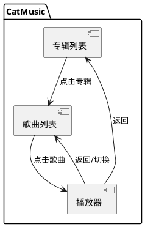

## 二、专辑列表模块

### 开发思路流程

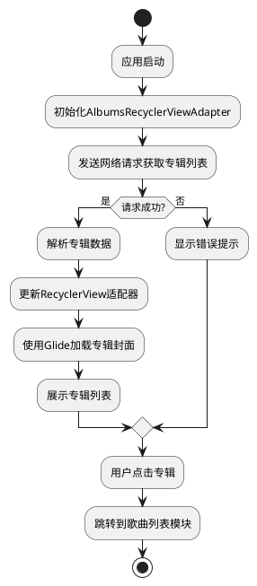

## 三、歌曲列表模块

### 开发思路流程

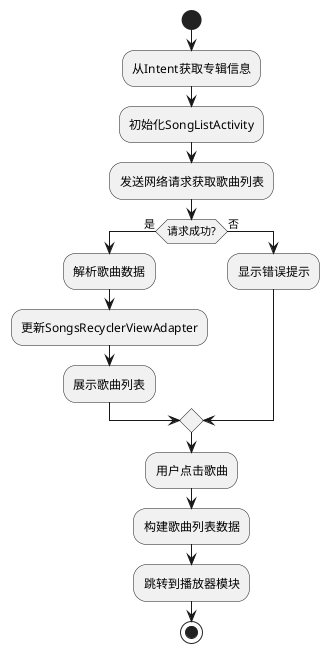

## 四、播放器模块

### 开发思路流程

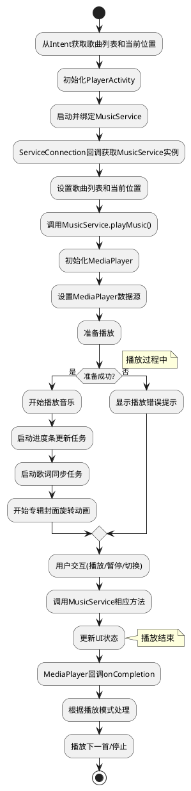

### 灵活的歌词解析

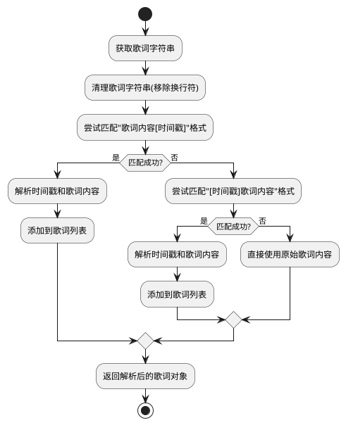

### 自定义 LyricView 设计

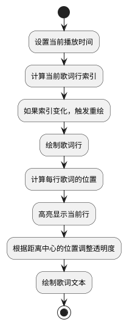

## 五、模块间协作流程

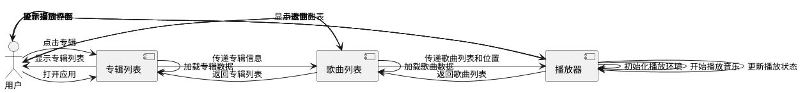

## 六、技术栈关系图

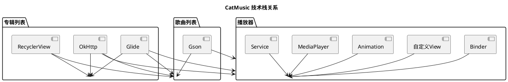

## 七、核心技术实现流程图

### 7.1 Service通信流程

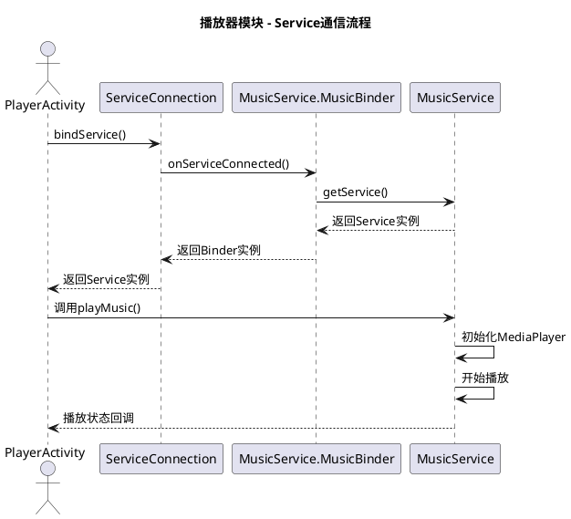

### 7.2 专辑封面动画流程

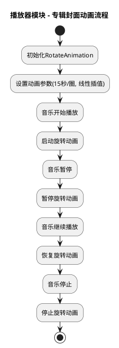

## 八、技术亮点与创新点

### 8.1 灵活的歌词解析

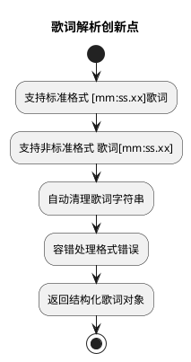

### 8.2 自定义LyricView设计

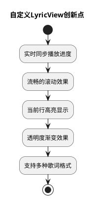

## 九、未来优化方向

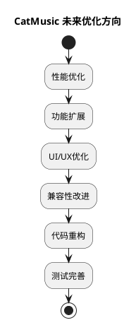
